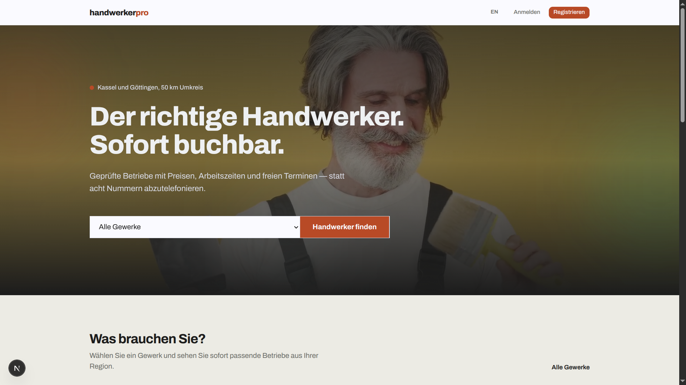
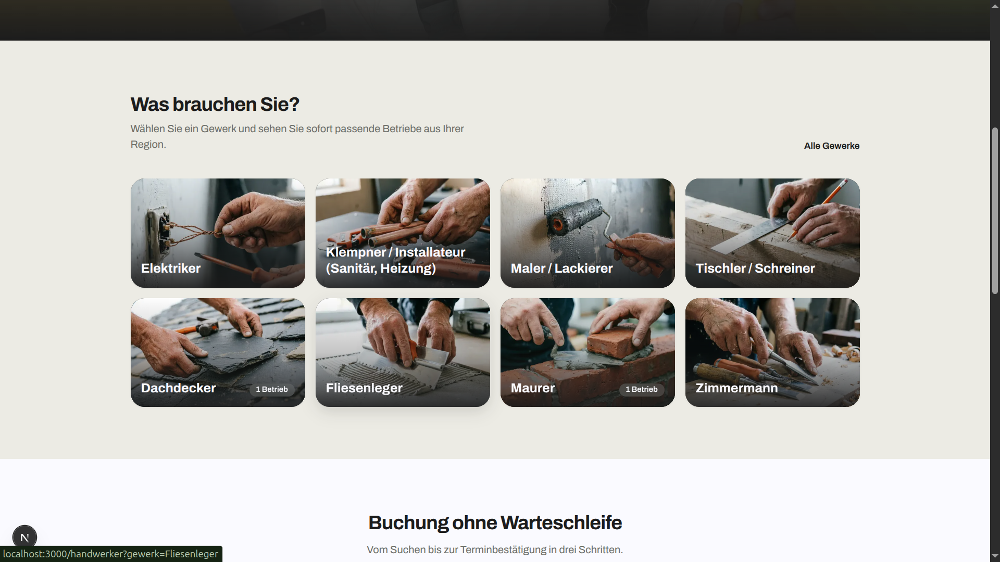
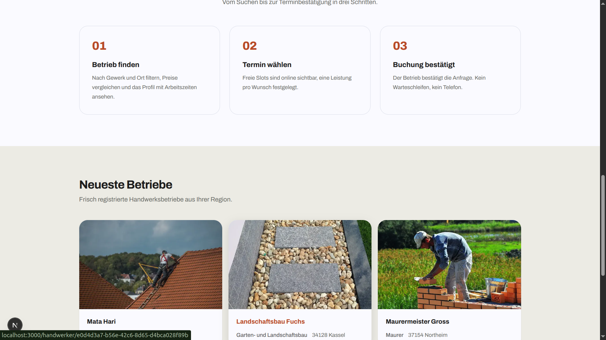
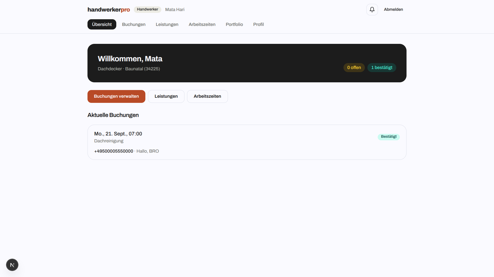
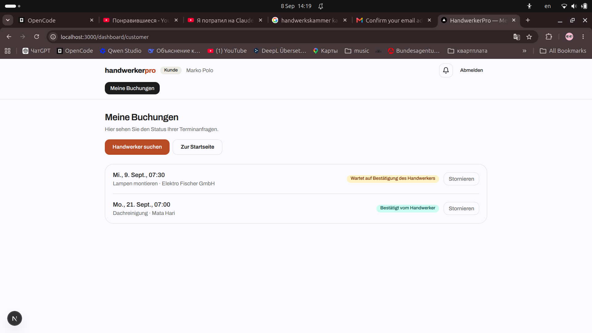
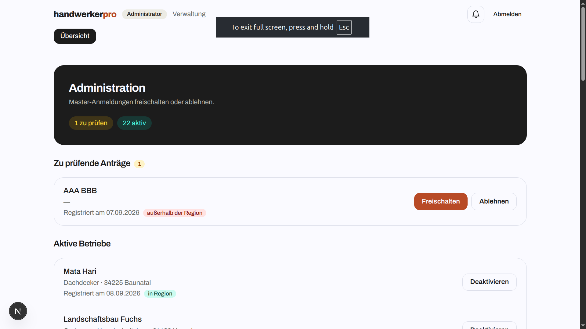

# handwerkerpro

Platform that connects customers with local handwerker (craftsmen/tradespeople) in the Kassel / Göttingen region (Germany). Customers find a master, pick a free time slot from a calendar and send a booking request. Masters confirm or decline requests from their dashboard. Admins approve new masters.

Built as a training project for the DCI full-stack curriculum — a complete, production-shaped booking platform on Vercel + Supabase.

## Screenshots

| Landing | Categories |
| :---: | :---: |
|  |  |

| Newest masters | Master dashboard |
| :---: | :---: |
|  |  |

| Customer dashboard | Admin dashboard |
| :---: | :---: |
|  |  |

## Features

- **Two registration flows** — customer (meine Buchungen) or handwerker (my business), both with email confirmation.
- **Geo-fence check before signup** for masters: the PLZ is geocoded and validated against the service area (≤ 50 km around Kassel or Göttingen). Out-of-range applicants are rejected before an account is even created.
- **Slot-based booking** — masters define their working hours; the platform generates free slots for the next 14 days. A compact **month calendar** shows only days with availability; picking a date reveals the free times.
- **Conflict-free slots** — pending and confirmed requests freeze the slot for everyone else. Double confirmation is blocked both on the server and by a partial unique index in Postgres.
- **Full booking lifecycle** — customer sends request (`pending`) → master confirms (`confirmed`) or declines (`declined`) → customer can cancel (`cancelled`) while pending/confirmed.
- **In-app notifications** — bell + auto-toast on the dashboard: new request, request confirmed, request declined, customer cancelled.
- **Role-based dashboards** — customer, handwerker (services, working hours, portfolio, profile) and admin (approve / deactivate masters).
- **Portfolio uploads** — masters upload work photos to Supabase Storage (WebP conversion, per-master folders, RLS-protected).
- **i18n** — German (default) and English, toggleable with a `?lang=` cookie.
- **German-market basics** — Impressum and Datenschutzerklärung pages.
- **Deliberate visual design** — custom ink/paper/brick palette, scroll-reveal animations, reduced-motion support.

## Tech Stack

| Layer | Tech |
| --- | --- |
| Framework | [Next.js 16](https://nextjs.org) (App Router, TypeScript, Tailwind CSS v4) |
| Backend / DB / Auth / Storage | [Supabase](https://supabase.com) (Postgres + Row Level Security, Auth, Storage) |
| Data fetching | Server Components + Server Actions, `zod` validation |
| UI | shadcn/ui components, `tw-animate-css`, custom design tokens |
| Tests | Vitest (unit tests for geo/slot/booking logic) |
| Deploy | Vercel |

## Project Structure

```
├── docs/
│   ├── sdd/                  # spec, schema, migrations, SQL setup
│   └── screenshots/          # README images
└── web/                      # Next.js application
    └── src/
        ├── app/
        │   ├── (marketing)/  # landing, /handwerker, /handwerker/[id], legal
        │   ├── (auth)/       # /login, /register
        │   ├── dashboard/    # customer, master, admin dashboards
        │   └── api/          # auth callback, notifications
        ├── components/       # ui + reveal animation
        └── lib/              # supabase clients, auth, geo, slots, booking, i18n, trades
```

## Getting Started

### 1. Supabase setup

Create a Supabase project and run the SQL files from `docs/sdd/` in this order:

1. `docs/sdd/schema.sql` — tables, enums, RLS policies, slot view, profile trigger
2. `docs/sdd/views/portfolio-storage.sql` — public storage bucket + policies for portfolio photos
3. `docs/sdd/migrations/002_freeze_pending_slots.sql` — pending+confirmed block slots; trigger with trade/plz coords
4. `docs/sdd/migrations/003_notifications.sql` — notifications table + `create_notification` helper

### 2. Environment

Create `web/.env.local`:

```env
NEXT_PUBLIC_SUPABASE_URL=https://YOUR-PROJECT.supabase.co
NEXT_PUBLIC_SUPABASE_ANON_KEY=YOUR_ANON_KEY
```

> The anon key is a publishable key (safe for the browser). Never commit service-role secrets.

### 3. Run locally

```bash
cd web
npm install
npm run dev
```

Open http://localhost:3000.

## Scripts

```bash
npm run dev      # development server
npm run build    # production build
npm run start    # start production build
npm run lint     # eslint
npm run test     # vitest (unit tests: haversine geo, slots, booking rules)
```

## Business Rules (summary)

- Masters within 50 km of Kassel or Göttingen can register; the region check runs before account creation.
- A slot becomes unavailable as soon as a request is sent (pending) — another customer cannot book it.
- Confirming a request is blocked if another booking is already confirmed for the same time.
- Customers cancel while the request is `pending` or `confirmed`; masters see a cancellation notification.
- New masters are `pending` until an admin sets them to `active`; only active masters appear in the catalog and can be booked.

## Deployment

- **Frontend**: Vercel, root directory `web`, framework preset Next.js.
- **Backend**: Supabase host — no extra servers needed; pick the same env-var names in Vercel.
- After pushing to `main`, Vercel rebuilds and the dashboard/booking flows are live.

## License

Intended for learning. Not affiliated with any real business.